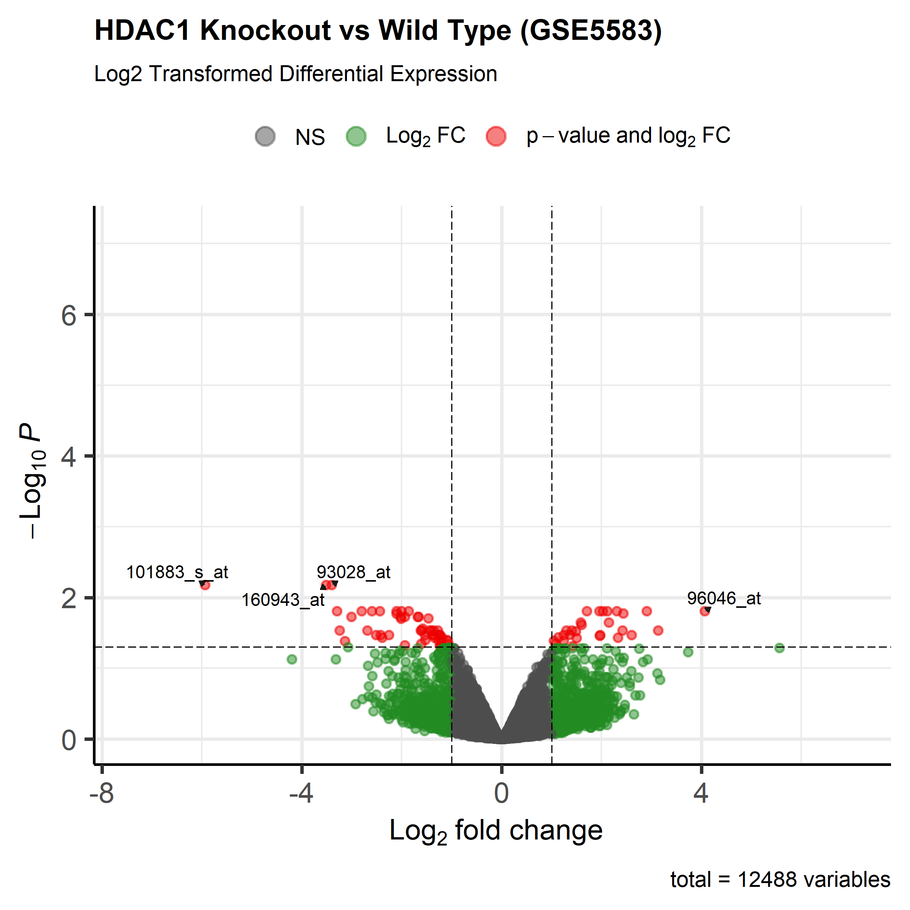

# HDAC1-differential-expression
Markdown
# Differential Expression Analysis & Volcano Plot Pipeline (GSE5583)

An end-to-end bioinformatics pipeline in R performing differential gene expression analysis on mouse microarray data (**GSE5583**) comparing **HDAC1 Knockout (KO)** vs **Wild Type (WT)** samples using `limma` and `EnhancedVolcano`.

---

## 📸 Publication-Grade Volcano Plot



---

## 📊 Dataset Overview
* **Source:** NCBI GEO Accession [GSE5583](https://www.ncbi.nlm.nih.gov/geo/query/acc.cgi?acc=GSE5583) (Affymetrix Mouse Genome 430 2.0 Array)
* **Sample Cohorts:** 3 Wild Type (`WT1`, `WT2`, `WT3`) vs 3 HDAC1 Knockout (`KO1`, `KO2`, `KO3`)
* **Total Variables:** 12,488 analyzed probe IDs

---

## 🛠️ Biological & Statistical Methodology

1. **Preprocessing & Log2 Normalization:**
   - Isolated gene/probe identifiers as matrix row names.
   - Applied a **$\text{log}_2$ transformation** (`log2(expr + 1)`) to raw microarray intensity values to stabilize variance and prevent artificially inflated fold-change calculations.

2. **Linear Modeling with `limma`:**
   - Parameterized experimental design using `model.matrix(~ group)`.
   - Computed moderated t-statistics and adjusted p-values via empirical Bayes moderation (`eBayes`).

3. **High-Resolution Visualization (`EnhancedVolcano`):**
   - Rendered publication-ready plot highlighting biologically and statistically significant target genes ($\text{adjusted } p < 0.05$ and $\vert{}\text{log}_2\text{FC}\vert{} > 1.0$).

---

## 💻 Complete R Script

```R
library(limma)
library(EnhancedVolcano)

# 1. Load dataset and configure matrix row names
data <- read.delim("HDAC1.tsv", header = TRUE, sep = "\t")
rownames(data) <- data$ID
expr_data <- data[, c("KO1", "KO2", "KO3", "WT1", "WT2", "WT3")]

# 2. Log2 transformation for raw microarray intensity data
expr_log2 <- log2(expr_data + 1)

# 3. Model differential expression using limma
group <- factor(c("KO", "KO", "KO", "WT", "WT", "WT"))
design <- model.matrix(~ group)

fit <- lmFit(expr_log2, design)
fit <- eBayes(fit)
res <- topTable(fit, coef = "groupWT", number = Inf)

# 4. Export high-resolution volcano plot
png("HDAC1_volcano_fixed.png", width = 2400, height = 2400, res = 300)

EnhancedVolcano(
  toptable = res,
  lab = rownames(res),
  x = 'logFC',
  y = 'adj.P.Val',
  pCutoff = 0.05,
  FCcutoff = 1.0,
  title = "HDAC1 Knockout vs Wild Type (GSE5583)",
  subtitle = "Log2 Transformed Differential Expression",
  labSize = 4.0,
  drawConnectors = TRUE
)

dev.off()
